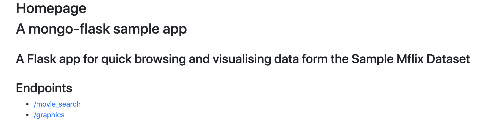
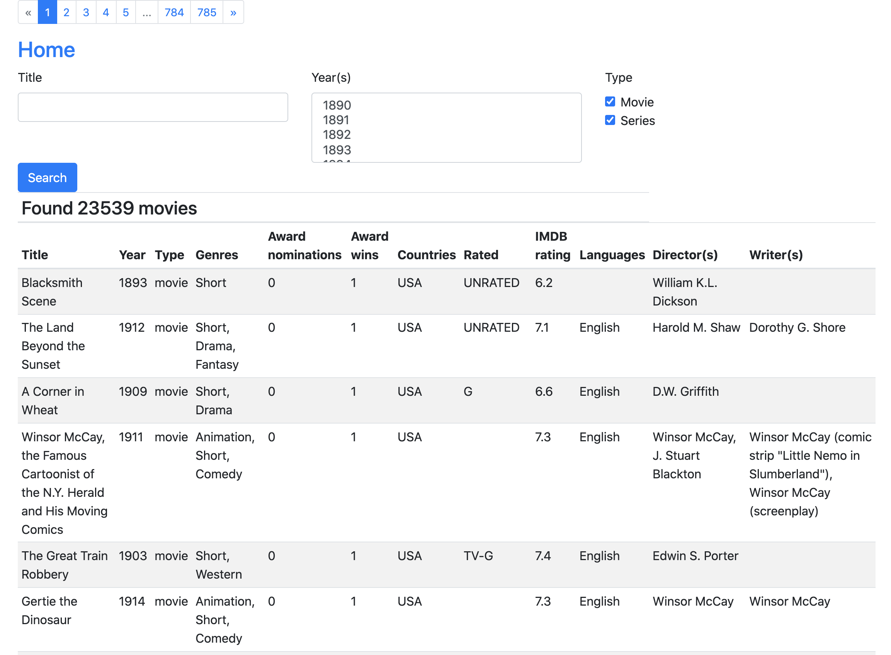
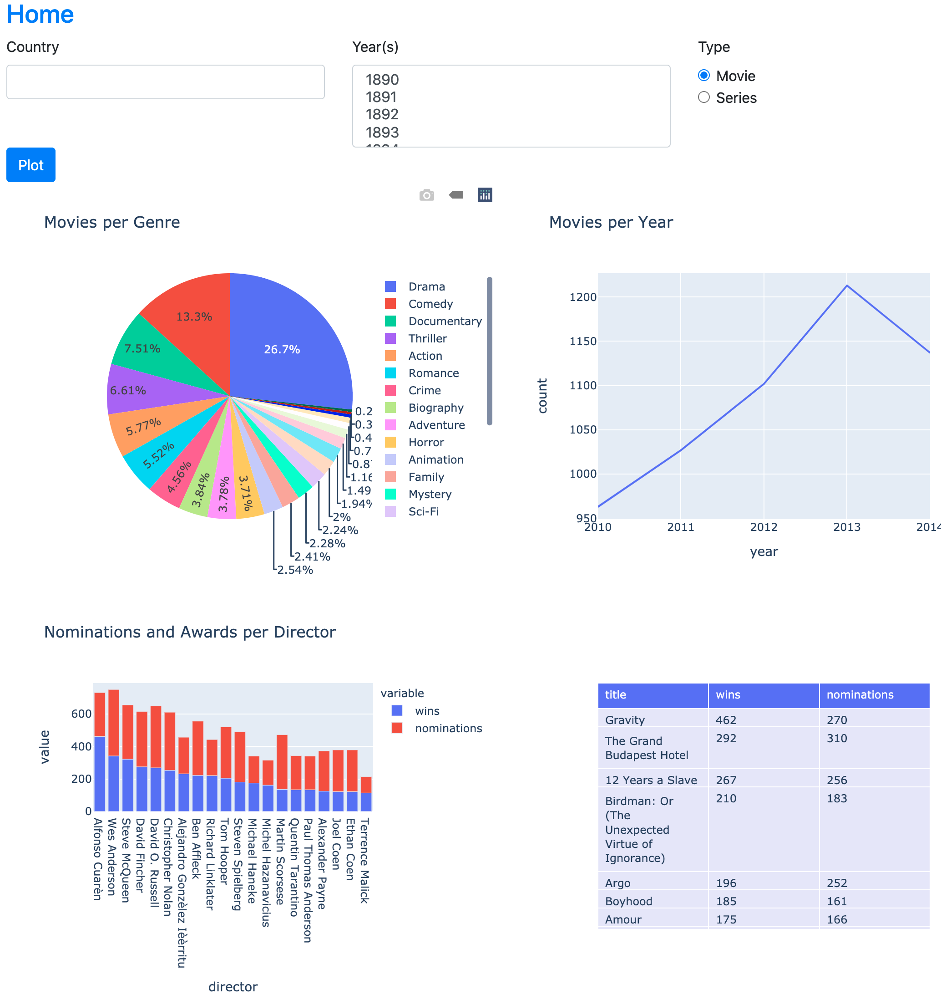

# Simple Flask web app on top of MongoDB

[](https://app.travis-ci.com/csioa/mongoflask)


### Importing data in MongoDB - movies collection 
```bash
mongoimport -u "<MONGO_ROOT_USER>" -p "<MONGO_ROOT_PASSWORD>" --authenticationDatabase "admin" --db movies --collection movies --file data/datasets/movies.json
```
### Sample .env file contains 
- MONGO_ROOT_USER=devroot
- MONGO_ROOT_PASSWORD=devroot
- MONGOEXPRESS_LOGIN=dev
- MONGOEXPRESS_PASSWORD=dev
- PAGE_ITEMS=30

### Getting started
```bash
docker compose --env-file .env up
```

### Home screen

```bash
http://localhost:5001
```

#### The home screen which has a small description and the available endpoints



#### The /movie_search endpoint will list movies according to the selected filters. If nothing is selected all movies will be listed.



#### The /graphics endpoint will show
- Number of movies per genre (pie chart)
- Number of movies per year (line graph)
- Number of award nomination/wins per director (stacked bar chart)
- List with the top 20 award winner and nominated movies

